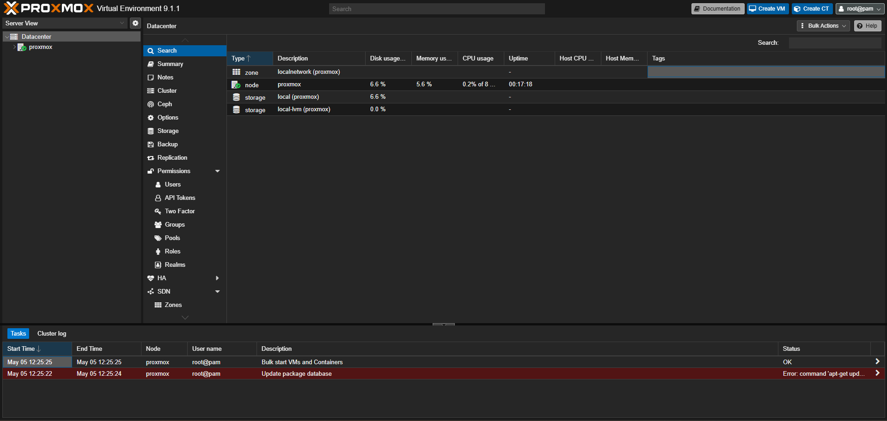
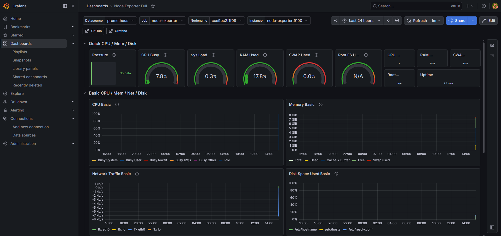
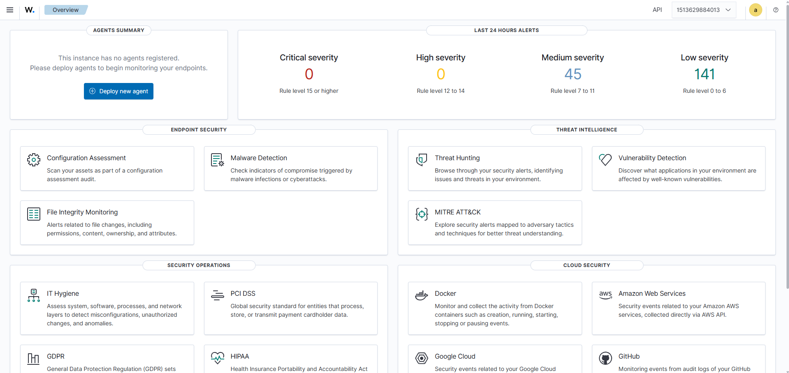
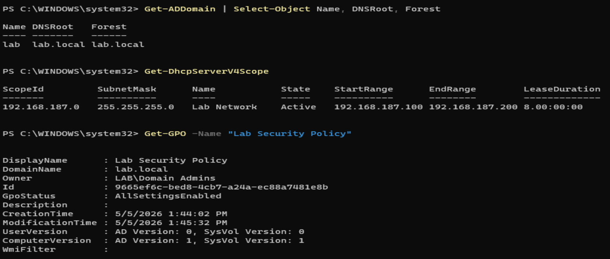
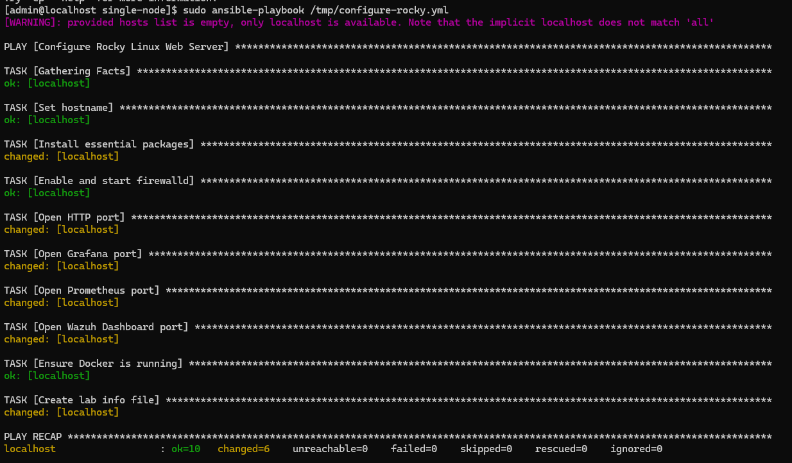
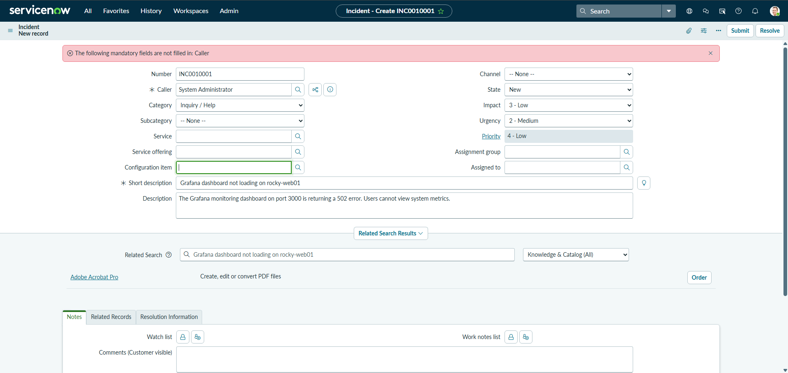

# Enterprise Infrastructure Home Lab

## About

I looked at several job postings for System Admin and Lab Admin intern roles. They all wanted experience with Active Directory, Linux, Docker, Ansible, monitoring, etc. So I just built it all myself to see how it works.

## What's Running

Everything runs on VMware Workstation on my Windows 11 PC.

- Proxmox VE 9.1
- Windows Server 2025 with Active Directory, DNS, DHCP, Group Policy
- Rocky Linux 10 running Docker with:
  - Nginx
  - Grafana + Prometheus + Node Exporter
  - Wazuh (Manager, Indexer, Dashboard)

## Screenshots

### Proxmox


### Grafana


### Wazuh


### AD / DNS / DHCP / GPO


### Ansible


### ServiceNow


## What I Used

- Proxmox VE, Windows Server 2025, Rocky Linux 10
- Docker and Docker Compose
- Ansible
- Grafana, Prometheus
- Wazuh
- GitHub Actions (CI/CD)
- ServiceNow

## Project Structure

```
ansible/            playbooks and inventory
docker/compose/     docker compose files
monitoring/         prometheus config
docs/screenshots/   screenshots
diagrams/           network diagram
.github/workflows/  CI/CD
```

## What I Learned

- AD, DNS, and DHCP all depend on each other in a domain
- Rocky Linux is basically RHEL, same commands and packages
- Docker Compose makes it easy to run multiple services together
- Ansible saves time when you have to configure the same thing on multiple servers
- Grafana is useless without a data source like Prometheus
- Wazuh setup is not simple but the dashboard is worth it
- CI/CD is just automated checks that run when you push code
- ServiceNow is what companies use for ticketing and change management
- Troubleshooting is where you actually learn things
