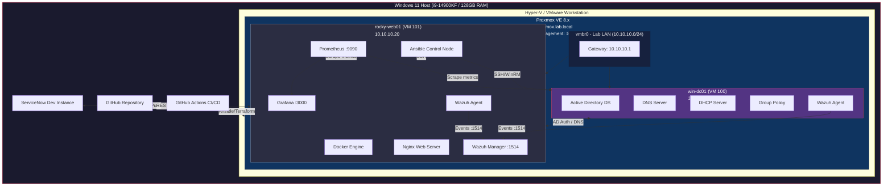

# Enterprise Infrastructure Home Lab - Network Diagram

## Mermaid Diagram

Render this diagram at https://mermaid.live or in any Markdown viewer that supports Mermaid.



## ASCII Diagram (for terminals and plain text)

```
┌─────────────────────────────────────────────────────────────────────────┐
│                    WINDOWS 11 HOST                                      │
│              i9-14900KF / 128GB RAM / 769GB                            │
│                                                                         │
│  ┌───────────────────────────────────────────────────────────────────┐  │
│  │              PROXMOX VE 8.x (Nested Virtualization)              │  │
│  │              Management UI: https://proxmox:8006                  │  │
│  │                                                                   │  │
│  │  ┌─────────── vmbr0: 10.10.10.0/24 (Lab LAN) ─────────────┐    │  │
│  │  │                    GW: 10.10.10.1                        │    │  │
│  │  │                                                          │    │  │
│  │  │  ┌──────────────────┐       ┌──────────────────────┐    │    │  │
│  │  │  │   win-dc01       │       │   rocky-web01        │    │    │  │
│  │  │  │   10.10.10.10    │       │   10.10.10.20        │    │    │  │
│  │  │  │                  │       │                      │    │    │  │
│  │  │  │  Win Server 2025 │◄─────►│  Rocky Linux 9       │    │    │  │
│  │  │  │                  │ AD/DNS│                      │    │    │  │
│  │  │  │  ┌────────────┐  │       │  ┌────────────────┐  │    │    │  │
│  │  │  │  │ AD DS      │  │       │  │ Docker         │  │    │    │  │
│  │  │  │  │ DNS        │  │       │  │  ├─ Nginx      │  │    │    │  │
│  │  │  │  │ DHCP       │  │       │  │  ├─ Grafana    │  │    │    │  │
│  │  │  │  │ GPO        │  │       │  │  ├─ Prometheus │  │    │    │  │
│  │  │  │  │ Wazuh Agent│  │       │  │  └─ Wazuh Mgr  │  │    │    │  │
│  │  │  │  └────────────┘  │       │  ├─ Ansible       │  │    │    │  │
│  │  │  │                  │       │  └─ Wazuh Agent    │  │    │    │  │
│  │  │  └──────────────────┘       └──────────────────────┘    │    │  │
│  │  └──────────────────────────────────────────────────────────┘    │  │
│  └───────────────────────────────────────────────────────────────────┘  │
│                                                                         │
│  External Services:                                                     │
│    ├─ GitHub + GitHub Actions ──► Ansible/Terraform ──► Proxmox API    │
│    └─ ServiceNow Dev Instance ◄──► REST API ──► rocky-web01            │
└─────────────────────────────────────────────────────────────────────────┘

Ports/Protocols:
  22/TCP    SSH (Linux)          3000/TCP  Grafana
  5985/TCP  WinRM (Windows)      9090/TCP  Prometheus
  8006/TCP  Proxmox Web UI       1514/TCP  Wazuh Agent
  53/UDP    DNS                  1515/TCP  Wazuh Registration
  80/TCP    HTTP (Nginx)         443/TCP   HTTPS
  443/TCP   HTTPS                9100/TCP  Node Exporter
```

## Service Map

| Service         | Host         | Port  | Protocol | Purpose                    |
|-----------------|--------------|-------|----------|----------------------------|
| Proxmox Web UI  | 10.10.10.1   | 8006  | HTTPS    | Hypervisor management      |
| Active Directory| 10.10.10.10  | 389   | LDAP     | Directory services         |
| DNS             | 10.10.10.10  | 53    | UDP/TCP  | Name resolution            |
| DHCP            | 10.10.10.10  | 67-68 | UDP      | IP address assignment      |
| WinRM           | 10.10.10.10  | 5985  | HTTP     | Windows remote management  |
| SSH             | 10.10.10.20  | 22    | TCP      | Linux remote access        |
| Nginx           | 10.10.10.20  | 80    | HTTP     | Web server                 |
| Grafana         | 10.10.10.20  | 3000  | HTTP     | Monitoring dashboards      |
| Prometheus      | 10.10.10.20  | 9090  | HTTP     | Metrics collection         |
| Node Exporter   | 10.10.10.20  | 9100  | HTTP     | Host metrics               |
| Wazuh Manager   | 10.10.10.20  | 1514  | TCP      | SIEM event collection      |
| Wazuh API       | 10.10.10.20  | 55000 | HTTPS    | Wazuh management API       |
| Wazuh Dashboard | 10.10.10.20  | 5601  | HTTPS    | Security dashboard         |
